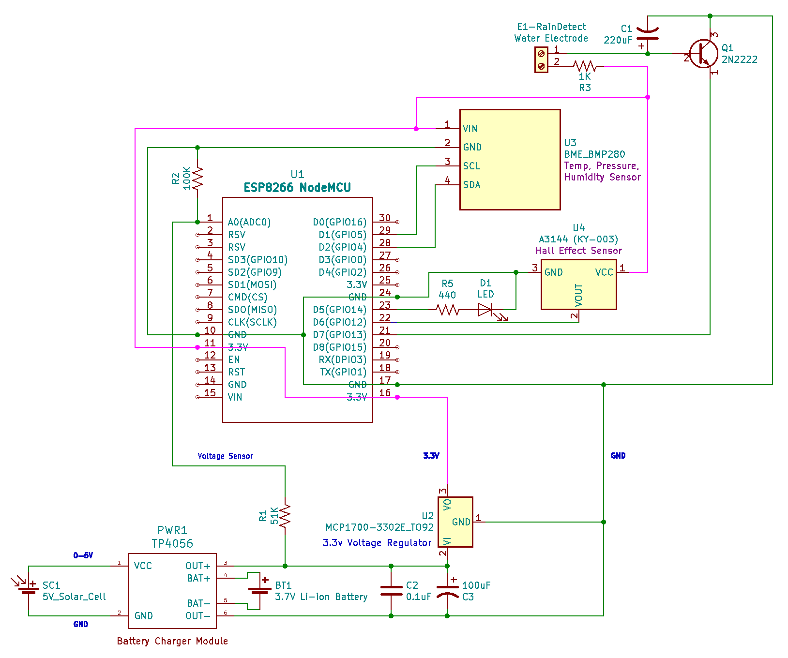

# WeatherStationWiFi
ESP8266 NodeMCU Based Solar Powered WiFi Weather Station

## Description
This project builds a solar powered Weather Station to return wather data via WiFi.  The project uses:
* ESP8266 NodeMCU - Arduino controller with WiFi
* BME280 module to measure Temperature, Humidity, and Pressure
* (optional) DS18B20 One-Wire bus temperature sensor for secondary measurement.
* 2N2222 NPN transitor powered water detector circuit to detect Rain.  
* 5V Solar cell, 3.7V lithium ion battery and a TP4056 constant-current/constant-voltage linear charger to charge the battery during the day.

## Circuit
Note: Currently the circuit prototype is being tested.

### Schematic

## List of Materials
#### Microcontroller
* 1 x ESP8266 NodeMCU - [Amazon](https://www.amazon.com/gp/product/B07XVKJ36C/ref=ppx_yo_dt_b_search_asin_title?ie=UTF8&psc=1)
#### Sensors
* 1 x BME280 module - [Amazon](https://www.amazon.com/gp/product/B07KYJNFMD/ref=ppx_yo_dt_b_search_asin_title?ie=UTF8&psc=1)
* 1 x DS18B20 (optional) - [Amazon](https://www.amazon.com/gp/product/B00CHEZ250/ref=ppx_yo_dt_b_search_asin_title?ie=UTF8&psc=1)
* 1 x 2N2222 NPN (rain detector) - [Amazon](https://www.amazon.com/McIgIcM-2N2222-Transistor-2N2222A-Through/dp/B06XPWS52G/ref=sxin_0_ac_d_pm?ac_md=1-0-VW5kZXIgJDg%3D-ac_d_pm&cv_ct_cx=2N2222&keywords=2N2222&pd_rd_i=B06XPWS52G&pd_rd_r=61542389-ebe1-4638-9974-cc8e7c05b550&pd_rd_w=6ELkQ&pd_rd_wg=xAkuD&pf_rd_p=516e6e17-ed95-417b-b7a4-ad2c7b9cbae3&pf_rd_r=VYHVP95KF3RKJ8RTAEXP&psc=1&qid=1584941623&s=lawn-garden&sr=1-1-22d05c05-1231-4126-b7c4-3e7a9c0027d0)
#### Solar Power Supply
* 1 x 2.5W 5V/500mAh Solar Cell - [Amazon](https://www.amazon.com/gp/product/B074TYH68Z/ref=ppx_yo_dt_b_search_asin_title?ie=UTF8&psc=1)
* 1 x 5V Micro USB 1A TP4056 Lithium Battery Charging Board with Protection Charger Module [Amazon](https://www.amazon.com/gp/product/B06XCXPY86/ref=ppx_yo_dt_b_search_asin_title?ie=UTF8&psc=1)
* 1 x 3.7V 3000mAh 755068 Battery Rechargeable Lithium Polymer ion Battery Pack - [Amazon](https://www.amazon.com/gp/product/B07TTD445R/ref=ppx_yo_dt_b_search_asin_title?ie=UTF8&psc=1)
* 1 x 3.3V Linear Regulator 250MA TO92-3 - [DigiKey](https://www.digikey.com/product-detail/en/microchip-technology/MCP1700-3302E-TO/MCP1700-3302E-TO-ND/652680)
#### Misc
* 1 x 440 Ohm Resistor
* 1 x 1k Ohm Resistor
* 1 x 5.1k Ohm Resistor
* 1 x 51k Ohm Resistor
* 1 x 100k Ohm Resistor
* 1 x Red LED
* 1 x 100uF Electrolytic Capacitor [DigiKey](https://www.digikey.com/product-detail/en/panasonic-electronic-components/ECA-1CM101I/P10408TB-ND/268493)
* 1 x 220uF Electrolytic Capacitor
* 1 x 0.1uF Ceramic Capactior - [Amazon](https://www.amazon.com/Almencla-100Pcs-Ceramic-Capacitor-Electronic/dp/B07LD9T497)

## Testing
The prototype has been tested over a week. The solar cell is able to charge the battery sufficiently to last through the night with very little drop in voltage. The following demonstrates the voltage plotted over several days. This data came directly from the ESP8266 as polled on the analog (A0) input every 5 minutes.

## References
* Solar Power + Battery + Monitoring - https://randomnerdtutorials.com/power-esp32-esp8266-solar-panels-battery-level-monitoring/
* BME280 Sensor - https://randomnerdtutorials.com/esp32-web-server-with-bme280-mini-weather-station/ 

